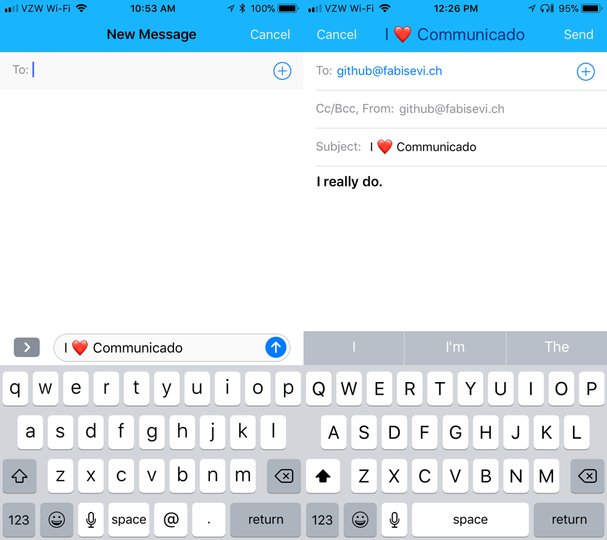

# Communicado

### Sharing on iOS made easy.

[](https://dashboard.buddybuild.com/apps/59b695f696d4600001f5144a/build/latest?branch=master)
[](https://cocoapods.org/)

 


---

#### Are you tired of rewriting the same sharing code over and over again?


#### Me too!


#### That's why I wrote Communicado! Let's show you how it's done.

Sharing
---

The first thing to know is can share from any `UIViewController` that conforms to `SharingCapableViewController`. Once you add this, you will get a `share` function on `UIViewController` which supports many built in sharing types.

You can share to:

- Messages
- Mail
- Pasteboard
- Photos
- UIActivityController
- Twitter (iOS 10.3 and lower)
- Facebook (iOS 10.3 and lower)
- Sina Weibo (iOS 10.3 and lower)
- Tencent Weibo (iOS 10.3 and lower)

Each sharing destination takes in parameters. Let's try a simple example.

```swift
let heartImageData = UIImagePNGRepresentation(myHeartImage)
let attachment = Attachment(attachmentType: AttachmentType.png, filename: "heart.png", data: heartImageData)
let messageParameters = MessageShareParameters(message: "I ❤️ Communicado", attachments: [ attachment ])
```

Now let's call the **ONLY** method that's even available to you.

```swift
self.share(messageParameters)
```

And when you're done, you'll get one unified callback with the information of how the share attempt went.

```swift
self.sharingCompleted = { shareResult in
    print("Was successful? \(shareResult.success)")
    print("Sharing service: \(shareResult.sharingService)")
}
```

You can do the same for the other sharing destinations as well.

```swift
self.share(MailShareParameters)
self.share(SocialShareParameters)
self.share(ActivityShareParameters)
self.share(PhotosShareParameters)
self.share(PasteboardShareParameters)
```

Styling
--- 

You can also use Communicado to style the `MFMailComposeViewController` and `MFMessageComposeViewController` with just a few lines of code. This works around all of the hoops Apple makes you jump through to style the built in sharing controllers.

All you have to do is:

```swift
self.sharingTitleTextAttributes = [
    NSAttributedString.Key.foregroundColor : UIColor.white,
    NSAttributedString.Key.font : UIFont.systemFont(ofSize: 21.0)
]

self.sharingBarButtonItemAttributes = [
    NSAttributedString.Key.foregroundColor : UIColor.purple,
    NSAttributedString.Key.font : UIFont.systemFont(ofSize: 16.0)
]

self.sharingBackgroundColor = UIColor.blue
```

And get something that looks like this: 



Beautiful, isn't it?


## Requirements

- iOS 9.0+
- Xcode 8.0+

## Installation
For **Swift 3** support, use version **2.0.2**. <br>
For **Swift 4** support, you can use version **3.0**. <br>
For **Swift 4.2** support, you can use version **3.1** or above. <br>
For **Swift 5.1** support, you can use version **3.2.0** or above.

You can use [SPM](https://swift.org/package-manager/) to install `Communicado`.

You can also use [CocoaPods](http://cocoapods.org/) to install `Communicado` by adding it to your `Podfile`:

```ruby
platform :ios, '9.0'
use_frameworks!

pod 'Communicado'
```

Or install it manually by downloading all the files in the `Source` folder and dropping them into your project.

## About me

Hi, I'm [Joe](http://fabisevi.ch) everywhere on the web, but especially on [Twitter](https://twitter.com/mergesort).

## License

See the [license](LICENSE) for more information about how you can use Communicado. I promise it's not GPL, because I am not "that guy".

## The end?

Yes, this is the end. Hopefully Communicado makes your life easier. It probably won't help you pay your rent, but it might make it easier to share in your app.
